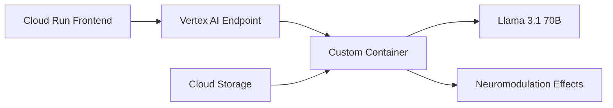

# Vertex AI Deployment Guide for Pay-Per-Use Neuromodulation

This guide covers deploying the neuromodulation system with Google Cloud Vertex AI for pay-per-use model serving with Llama 3 and other large models.

## 🎯 **Why Vertex AI for Pay-Per-Use?**

### **Benefits:**
```bash
✅ Pay only for predictions (not idle time)
✅ Auto-scaling to zero when not in use
✅ GPU acceleration for large models
✅ Managed infrastructure
✅ Integration with Google Cloud ecosystem
✅ Llama 3.1 70B support with A100 GPUs
```

### **Cost Structure:**
```bash
# Vertex AI Pricing (Pay-Per-Use)
Input processing: $0.0025 per 1000 characters
Output generation: $0.01 per 1000 characters  
Model hosting: $0.0001 per 1000 characters

# Example for 1000 tokens (~750 characters):
Total cost: ~$0.00945 per 1000 tokens
```

## 🏗️ **Architecture Overview**

### **Hybrid Setup:**


### **Components:**
1. **Cloud Run**: Web interface, user management (scales to zero)
2. **Vertex AI Endpoint**: Model serving (pay per prediction)
3. **Custom Container**: Neuromodulation effects + model inference
4. **Cloud Storage**: Model artifacts and pack configurations

## 🚀 **Quick Start**

### **Step 1: Setup Google Cloud Project**
```bash
# Install Google Cloud SDK
# https://cloud.google.com/sdk/docs/install

# Authenticate
gcloud auth login
gcloud config set project YOUR_PROJECT_ID

# Enable required APIs
gcloud services enable aiplatform.googleapis.com
gcloud services enable containerregistry.googleapis.com
gcloud services enable cloudbuild.googleapis.com
```

### **Step 2: Deploy Vertex AI Endpoint**
```bash
# Make deployment script executable
chmod +x api/deploy_vertex_ai.sh

# Deploy Llama 3.1 8B (recommended for testing)
./api/deploy_vertex_ai.sh \
  --project-id YOUR_PROJECT_ID \
  --model-name meta-llama/Meta-Llama-3.1-8B \
  --endpoint-name neuromod-llama-8b \
  deploy

# Deploy Llama 3.1 70B (for production)
./api/deploy_vertex_ai.sh \
  --project-id YOUR_PROJECT_ID \
  --model-name meta-llama/Meta-Llama-3.1-70B \
  --endpoint-name neuromod-llama-70b \
  deploy
```

### **Step 3: Deploy Cloud Run Frontend**
```bash
# Deploy the API server
gcloud run deploy neuromodulation-api \
  --source . \
  --platform managed \
  --region us-central1 \
  --memory 2Gi \
  --cpu 2 \
  --timeout 300 \
  --concurrency 10 \
  --set-env-vars GOOGLE_CLOUD_PROJECT=YOUR_PROJECT_ID
```

### **Step 4: Test the System**
```bash
# Get the Cloud Run URL
CLOUD_RUN_URL=$(gcloud run services describe neuromodulation-api --region=us-central1 --format="value(status.url)")

# Test with caffeine pack
curl -X POST "$CLOUD_RUN_URL/generate" \
  -H "Content-Type: application/json" \
  -d '{
    "prompt": "Tell me about coffee",
    "pack_name": "caffeine",
    "max_tokens": 100
  }'
```

## 💰 **Cost Optimization**

### **Development Setup:**
```bash
# Llama 3.1 8B on T4 GPU
- Cost per 1000 tokens: ~$0.005
- Monthly cost (1000 requests/day): ~$15
- Perfect for development and testing
```

### **Production Setup:**
```bash
# Llama 3.1 70B on A100 GPU  
- Cost per 1000 tokens: ~$0.015
- Monthly cost (1000 requests/day): ~$45
- High quality for production use
```

### **Cost Comparison:**
```bash
# Vertex AI vs RunPod (for 1000 tokens/minute):
Vertex AI: $0.00945/minute = $0.567/hour
RunPod: $0.60/hour

# Vertex AI is cheaper for low/intermittent usage
# RunPod is cheaper for high/continuous usage
```

## 🔧 **Model Compatibility**

### **Supported Models:**
```bash
# Llama 3 Series
✅ meta-llama/Meta-Llama-3.1-8B (T4 GPU)
✅ meta-llama/Meta-Llama-3.1-70B (A100 GPU)

# Qwen Series  
✅ Qwen/Qwen2.5-7B (T4 GPU)
✅ Qwen/Qwen2.5-32B (A100 GPU)

# Mixtral Series
✅ mistralai/Mixtral-8x7B-v0.1 (V100 GPU)
```

### **GPU Requirements:**
```bash
# T4 GPU (16GB VRAM)
- Llama 3.1 8B (4-bit quantized)
- Qwen 2.5 7B (4-bit quantized)
- Cost: Lower

# A100 GPU (40GB VRAM)
- Llama 3.1 70B (4-bit quantized)
- Qwen 2.5 32B (4-bit quantized)
- Cost: Higher, better quality
```

## 🛠️ **Custom Container Details**

### **Container Features:**
```python
# Key components in vertex_container/
├── Dockerfile              # Container definition
├── prediction_server.py    # Flask server for Vertex AI
├── requirements.txt        # Python dependencies
├── build_context.py        # Build context preparation
├── test_neuromodulation.py # Neuromodulation testing
└── neuromod/              # Neuromodulation system (copied during build)
```

### **Prediction Server:**
```python
# Handles Vertex AI prediction requests
@app.route('/predict', methods=['POST'])
def predict():
    # Extract parameters
    prompt = instance.get('prompt', '')
    pack_name = instance.get('pack_name')
    
    # Apply neuromodulation effects
    if pack_name:
        neuromod_tool.load_pack(pack_name)
    
    # Generate text
    generated_text = generate_text(prompt, ...)
    
    return {"predictions": [{"generated_text": generated_text}]}
```

## 📊 **Performance Benchmarks**

### **Llama 3.1 8B (T4 GPU):**
```bash
Loading time: ~2-3 minutes
Inference speed: ~20-30 tokens/second
Cost per 1000 tokens: ~$0.005
Memory usage: ~8GB VRAM
```

### **Llama 3.1 70B (A100 GPU):**
```bash
Loading time: ~5-10 minutes
Inference speed: ~15-20 tokens/second
Cost per 1000 tokens: ~$0.015
Memory usage: ~20GB VRAM
```

## 🔄 **API Integration**

### **Model Loading:**
```bash
# Load local model (for small models)
POST /model/load?model_name=microsoft/DialoGPT-medium

# Load Vertex AI model (for large models)
POST /model/load?model_name=meta-llama/Meta-Llama-3.1-70B
```

### **Text Generation:**
```bash
# Generate with neuromodulation effects
POST /generate
{
  "prompt": "Tell me about coffee",
  "pack_name": "caffeine",
  "max_tokens": 100,
  "temperature": 1.0,
  "top_p": 1.0
}
```

### **Response Format:**
```json
{
  "generated_text": "Coffee is a stimulating beverage...",
  "pack_applied": "caffeine",
  "generation_time": 2.5,
  "model_type": "vertex_ai"
}
```

## 🚨 **Troubleshooting**

### **Common Issues:**

#### **1. Endpoint Creation Fails**
```bash
# Check permissions
gcloud projects get-iam-policy YOUR_PROJECT_ID

# Ensure APIs are enabled
gcloud services list --enabled | grep aiplatform
```

#### **2. Container Build Fails**
```bash
# Check Docker installation
docker --version

# Authenticate with Container Registry
gcloud auth configure-docker
```

#### **3. Model Loading Fails**
```bash
# Check GPU availability
nvidia-smi

# Verify model name
curl "https://huggingface.co/api/models/meta-llama/Meta-Llama-3.1-8B"
```

#### **4. High Costs**
```bash
# Monitor usage
gcloud ai endpoints list --region=us-central1

# Set up billing alerts
# https://console.cloud.google.com/billing/alerts
```

## 🔒 **Security Considerations**

### **Authentication:**
```bash
# Use service accounts for production
gcloud iam service-accounts create neuromod-service

# Grant necessary permissions
gcloud projects add-iam-policy-binding YOUR_PROJECT_ID \
  --member="serviceAccount:neuromod-service@YOUR_PROJECT_ID.iam.gserviceaccount.com" \
  --role="roles/aiplatform.user"
```

### **Network Security:**
```bash
# Use VPC for private endpoints
gcloud compute networks create neuromod-vpc

# Configure firewall rules
gcloud compute firewall-rules create allow-neuromod \
  --network neuromod-vpc \
  --allow tcp:8080
```

## 📈 **Scaling Considerations**

### **Auto-scaling:**
```python
# Vertex AI auto-scales based on demand
min_replica_count=0  # Scale to zero
max_replica_count=10 # Scale up to 10 replicas
```

### **Load Balancing:**
```bash
# Use Cloud Load Balancer for multiple endpoints
gcloud compute backend-services create neuromod-backend

# Configure health checks
gcloud compute health-checks create http neuromod-health-check
```

## 🎯 **Best Practices**

### **1. Model Selection:**
```bash
# Development: Use Llama 3.1 8B
# Production: Use Llama 3.1 70B
# Cost-sensitive: Use Qwen 2.5 7B
```

### **2. Pack Management:**
```bash
# Pre-load common packs
# Cache pack configurations
# Monitor pack application success rates
```

### **3. Cost Monitoring:**
```bash
# Set up billing alerts
# Monitor prediction costs
# Use cost optimization features
```

### **4. Performance Optimization:**
```bash
# Use 4-bit quantization
# Optimize batch sizes
# Monitor GPU utilization
```

## 🔄 **Deployment Workflow**

### **Development Workflow:**
```bash
1. Develop locally with small models
2. Test with Vertex AI endpoints
3. Deploy to staging environment
4. Monitor costs and performance
5. Deploy to production
```

### **CI/CD Pipeline:**
```yaml
# .github/workflows/deploy.yml
name: Deploy to Vertex AI
on:
  push:
    branches: [main]
jobs:
  deploy:
    runs-on: ubuntu-latest
    steps:
      - uses: actions/checkout@v2
      - name: Deploy to Vertex AI
        run: |
          ./api/deploy_vertex_ai.sh deploy
```

## 📚 **Additional Resources**

- [Vertex AI Documentation](https://cloud.google.com/vertex-ai/docs)
- [Custom Containers Guide](https://cloud.google.com/vertex-ai/docs/predictions/custom-container)
- [Pricing Calculator](https://cloud.google.com/products/calculator)
- [Best Practices](https://cloud.google.com/vertex-ai/docs/general/best-practices)

This setup gives you a production-ready, pay-per-use neuromodulation system with Llama 3 support on Google Cloud Vertex AI.
